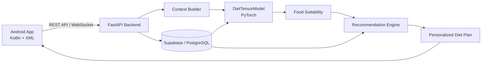
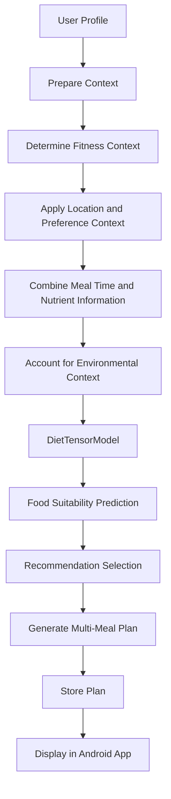

# Context-Aware Diet Recommender System

A personalized diet recommendation module developed as part of **FitAvatar**, an AI-powered fitness assistant. The system moves beyond generic meal recommendations by using user-specific and contextual information such as fitness goals, BMI-related profile information, country/location, meal timing, dietary preferences, nutrients, and environmental conditions.

The recommender is implemented as a **PyTorch-based DietTensorModel** and integrated into a **FastAPI backend**, allowing the mobile application to request personalized meal plans through an API.

## Overview

Traditional fitness applications commonly provide fixed diet charts or generic meal suggestions. Such recommendations may not fit a user's fitness goal, location, dietary preferences, meal timing, or environmental conditions.

The Context-Aware Diet Recommender was designed to address this problem by incorporating multiple dimensions of user context into food suitability prediction and meal-plan generation.

**User Profile + Fitness Context + Food Information → DietTensorModel → Personalized Food Suitability → Meal Plan**

## Problem Statement

Generic diet recommendations have several practical limitations: they may ignore fitness goals, local food availability, BMI/profile information, dietary preferences, and environmental conditions. Static diet charts also do not easily adapt when the user's context changes.

## Solution

The system uses user-specific profile data and contextual information to generate personalized food recommendations and structured multi-meal diet plans.

Inputs include:

- Weight, height, age, gender
- Fitness goal
- Country/location
- Dietary preferences
- Workout intensity
- Meal time
- Food nutrient information
- Environmental conditions such as hot/cold weather

## Key Features

- Personalized recommendations based on user profile and goals
- Context-aware food suitability prediction
- Location-aware food recommendations
- Goal-aware meal planning
- Environmental/weather-aware recommendation logic
- Multi-meal diet-plan generation
- Food quantities and protein information
- FastAPI backend integration
- Persistent storage of generated plans in Supabase/PostgreSQL

## How It Works

```text
┌───────────────────────┐
│      User Profile     │
│-----------------------│
│ Age / Gender          │
│ Height / Weight       │
│ Fitness Goal          │
│ Country               │
│ Preferences           │
└───────────┬───────────┘
            │
            ▼
┌───────────────────────┐
│ Context Construction  │
│-----------------------│
│ BMI / Goal            │
│ Meal Time             │
│ Nutrients             │
│ Location              │
│ Weather / Environment │
└───────────┬───────────┘
            │
            ▼
┌───────────────────────┐
│   DietTensorModel     │
│       (PyTorch)       │
│-----------------------│
│ Food suitability      │
│ prediction/scoring    │
└───────────┬───────────┘
            │
            ▼
┌───────────────────────┐
│ Recommendation Engine │
│-----------------------│
│ Meal selection        │
│ Food filtering        │
│ Context rules         │
└───────────┬───────────┘
            │
            ▼
┌───────────────────────┐
│ Personalized Plan     │
│-----------------------│
│ Multiple meals        │
│ Food options          │
│ Gram quantities       │
│ Protein information   │
└───────────┬───────────┘
            │
            ▼
┌───────────────────────┐
│ FastAPI REST API      │
└───────────┬───────────┘
            │
            ▼
┌───────────────────────┐
│ FitAvatar Android App │
└───────────────────────┘
```

## System Architecture



## Recommendation Pipeline



## Recommendation Logic

The documented design includes the following context-aware examples.

### Underweight + Muscle Gain + Hot Weather

```text
High-calorie foods + Protein-rich foods + Cooling foods
```

### Normal BMI + Muscle Gain + Cold Weather

```text
Balanced diet + Protein-rich foods + Warm foods
```

### Overweight + Weight Loss + Hot Weather

```text
Low-calorie meals + Cooling foods
```

### Normal BMI + Muscle Gain + Cold Weather + Non-Vegetarian

```text
Protein-rich foods + Warm foods
```

## Machine Learning Component

### DietTensorModel

The diet engine uses a custom **PyTorch neural network named DietTensorModel** for personalized food suitability prediction. The documented model considers contextual dimensions including **user/goal, country, meal time, and nutrients**.

The intended formulation combines:

```text
User Context
     +
Food Characteristics
     +
Country / Location
     +
Meal Time
     +
Nutrient Information
```

The project documentation selected PyTorch instead of a simple rule-based/scikit-learn approach because a trainable model can capture interactions across multiple context dimensions.

## Backend Integration

The recommender is integrated into a Python **FastAPI backend**. The backend receives the user's context, runs AI inference/recommendation logic, returns the generated plan, and supports persistent storage.

```text
Android Application
        │
        │ API Request
        ▼
   FastAPI Backend
        │
        ├── Context Preparation
        │
        ├── DietTensorModel
        │
        └── Recommendation Logic
                │
                ▼
        Personalized Diet Plan
                │
                ▼
          Android Application
```

## Database

**Supabase / PostgreSQL** is used for structured persistent storage, including:

- User profiles
- Exercise session history
- Pose-analysis logs
- Generated diet plans
- Meal options
- Food dataset

## Example User Flow

A documented functional test uses the following profile:

```text
Age:        22
Gender:     Male
Weight:     75 kg
Height:     175 cm
Goal:       Weight Gain
Country:    Pakistan
```

Flow:

1. User logs into FitAvatar.
2. User opens the **Diet Plan** section.
3. User selects **Generate My Diet Plan**.
4. The backend processes stored profile and contextual information.
5. The model predicts foods per meal time according to location/context.
6. A personalized meal plan is returned to the application.
7. The plan is displayed to the user.
8. The generated plan is saved in diet history.

## Output Structure

The tested output is structured as a multi-meal plan with two options per meal, including food quantities and protein values.

```text
Meal 1
├── Option 1 → food + quantity (g) + protein
└── Option 2 → food + quantity (g) + protein

Meal 2
├── Option 1
└── Option 2

Meal 3
├── Option 1
└── Option 2

Meal 4
├── Option 1
└── Option 2
```

## Functional Result

The documented functional test successfully verified that the module can generate and display a **4-meal personalized diet plan**, with **two options per meal**, food quantities in grams, protein values, and location-constrained recommendations. The generated plan was also saved in diet history.

**Functional test result: PASS**

> The project documentation provides functional verification but does not provide a standalone numerical ML accuracy benchmark for DietTensorModel. No unsupported accuracy claim is made here.

## Project Structure

A repository layout can be organized as:

```text
context-aware-diet-recommender/
│
├── README.md
├── requirements.txt
├── .gitignore
│
├── data/
│   └── README.md
├── models/
│   └── README.md
├── src/
│   ├── __init__.py
│   ├── model.py
│   ├── preprocessing.py
│   ├── recommender.py
│   └── utils.py
├── api/
│   ├── __init__.py
│   └── app.py
└── notebooks/
    └── training.ipynb
```

Adjust filenames to match the actual implementation in the repository.

## Installation

### Clone

```bash
git clone https://github.com/<your-username>/<your-repository>.git
cd context-aware-diet-recommender
```

### Virtual environment

Windows:

```bash
python -m venv venv
venv\Scripts\activate
```

Linux/macOS:

```bash
python3 -m venv venv
source venv/bin/activate
```

### Install dependencies

```bash
pip install -r requirements.txt
```

## Usage

A conceptual Python usage example is:

```python
from src.recommender import generate_diet_plan

user_context = {
    "age": 22,
    "gender": "male",
    "weight": 75,
    "height": 175,
    "goal": "weight_gain",
    "country": "Pakistan",
}

diet_plan = generate_diet_plan(user_context)
print(diet_plan)
```

Replace the import/function name with the actual entry point in your implementation.

## API Integration

A typical API interface can follow this pattern:

```http
POST /diet/generate
Content-Type: application/json
```

Example request:

```json
{
  "age": 22,
  "gender": "male",
  "weight": 75,
  "height": 175,
  "goal": "weight_gain",
  "country": "Pakistan"
}
```

Example response shape:

```json
{
  "status": "success",
  "meals": [
    {
      "meal": "breakfast",
      "options": [
        {
          "food": "...",
          "quantity_g": 0,
          "protein_g": 0
        },
        {
          "food": "...",
          "quantity_g": 0,
          "protein_g": 0
        }
      ]
    }
  ]
}
```

Use the actual endpoint and response schema from the implementation when publishing the final repository.

## Configuration

Keep secrets and environment-specific values outside source code. For example:

```text
DATABASE_URL=...
MODEL_PATH=...
API_HOST=...
API_PORT=...
```

Use a `.env` file locally and exclude it from version control.

## Requirements

Core technologies documented for this module include:

- Python
- PyTorch
- FastAPI
- Supabase / PostgreSQL
- Pandas
- NumPy

See [requirements.txt](requirements.txt) for the dependency list.

## Impact

The primary value of this module is transforming diet planning from a **generic one-size-fits-all process** into a **context-aware recommendation workflow**.

Instead of returning the same suggestions to every user, the system uses profile and context to produce recommendations relevant to the user's goals, location, meal timing, dietary context, nutrient information, and environmental conditions. Because it is integrated with the application backend, recommendations are generated inside the fitness workflow and saved in the user's diet history.

## Limitations

- The trainable diet model requires labelled training data.
- Backend-hosted AI inference introduces network/inference latency relative to fully on-device execution.
- The documented implementation is an FYP-scale system and does not establish production-scale generalization.
- The available project documentation does not provide a comprehensive independent benchmark of recommendation quality across a large held-out user population.

## Future Improvements

- Expand and diversify the food dataset.
- Add richer dietary restrictions and allergy handling.
- Incorporate more environmental/context variables.
- Learn continuously from user feedback.
- Add nutrition-target optimization.
- Provide recommendation explanations.
- Benchmark recommendation quality on larger held-out datasets.
- Investigate edge/offline inference.

## Tech Stack

| Category | Technology |
|---|---|
| Language | Python |
| Deep Learning | PyTorch |
| Model | DietTensorModel |
| Backend | FastAPI |
| Database | Supabase / PostgreSQL |
| Data Processing | Pandas, NumPy |
| Client | Android (Kotlin + XML) |
| API Communication | REST APIs / WebSockets |

## Acknowledgements

Developed as part of **FitAvatar — Fitness Assistant with Context-Aware Diet Guidance**.

## Note

This README is based on the project documentation supplied for FitAvatar. It deliberately avoids adding unsupported model-accuracy claims or implementation details that are not established by that documentation.
